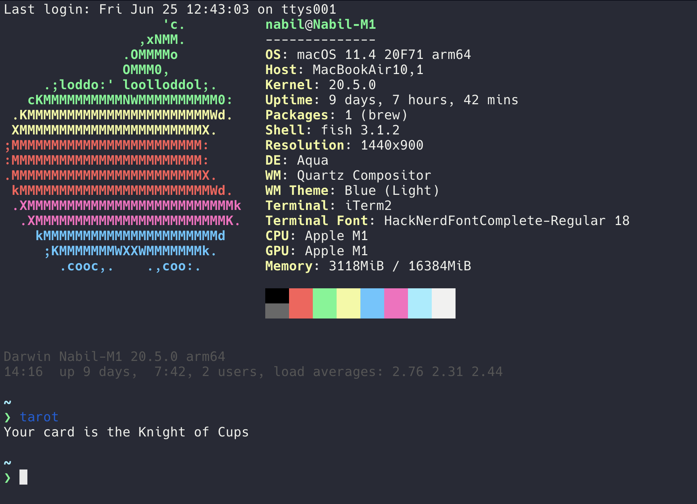

# tarotfish

tarotfish is a very, very simple Fish script that allows you to draw a card from the standard Terot de Marseilles deck. 

# Installation

You can just run the script from wherever you run it. You may need to chmod +x the script, and the shebang line (the first line) may need to change. 

# Better Installation

1. Delete the first line of the file
2. In fish, type func tarot
3. Paste the contents of the file
4. Create a new line (hit enter) 
5. type end
6. hit enter
7. type funcsave tarot
8. restart fish

Now, anytime you want to draw a card, just type tarot. 
